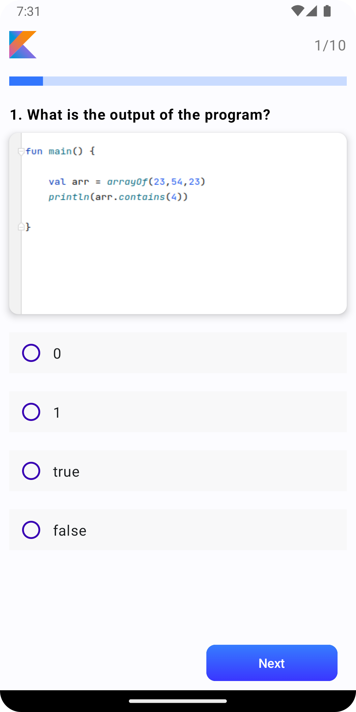
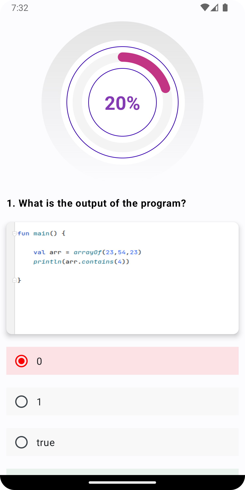

# Quiz-App
It is a quiz app that contains kotlin question

## Built using
- [Kotlin 💙](https://kotlinlang.org/) - Official programming language for Android development.
- [Jetpack Compose](https://developer.android.com/jetpack/compose?gclid=Cj0KCQiA_bieBhDSARIsADU4zLffNBDtqhq7TjvJAbgJxjcAdswUWq6NiSDI-9A0Y-fIoGfp7pvoPMAaAn1HEALw_wcB&gclsrc=aw.ds) - For backend and frontend.
- [Material Design 3 for Android](https://developer.android.com/jetpack/androidx/releases/compose-material3) - For Material UI.

|                    Start Quiz                     |                     Start Quiz black                      |
|:-------------------------------------------------:|:---------------------------------------------------------:|
|  |  |

|                   Quiz                    |                    Quiz black                     |
|:-----------------------------------------:|:-------------------------------------------------:|
|  |  |

|                   Result                    |                     Result black                     |
|:-------------------------------------------:|:----------------------------------------------------:|
|  |  |
